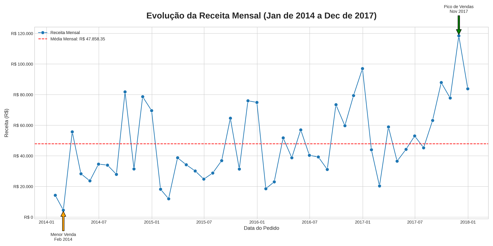
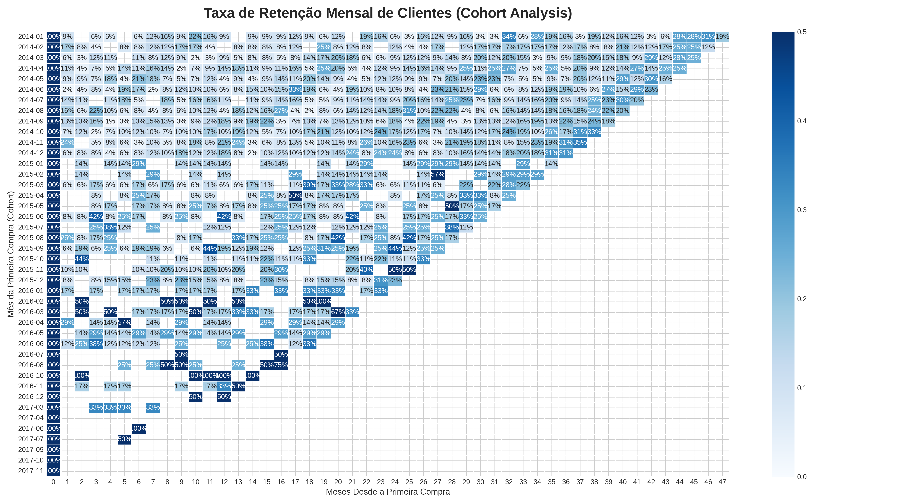
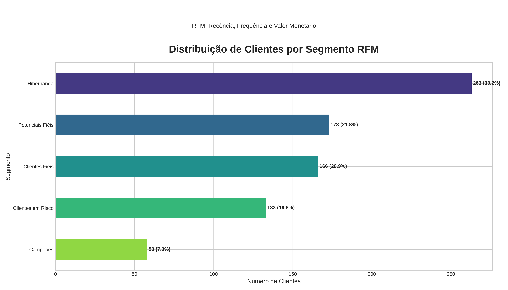

# 📊 Análise de Vendas e Clientes da SuperStore

## 📄 Visão Geral do Projeto

Este projeto realiza uma análise exploratória dos dados da rede SuperStore, com o objetivo de extrair insights de negócios. O foco principal está em entender o desempenho de vendas, a retenção de clientes (Análise de Cohort) e a segmentação de clientes com base em seu comportamento de compra (Análise RFM).

O projeto foi originalmente desenvolvido em Excel e replicado em Python para criar um fluxo de trabalho automatizado, escalável e reprodutível.

## ❓ Questões de Negócio Analisadas

1.  **Desempenho de Vendas:** As receitas estão aumentando, estagnadas ou diminuindo ao longo do tempo?
2.  **Retenção de Clientes:** Qual é a taxa de retenção de clientes ao longo dos meses? Quais grupos (cohorts) são mais fiéis?
3.  **Segmentação de Clientes:** Quem são os melhores clientes ("Campeões")? E quais clientes estão em risco de churn?

## 🛠️ Ferramentas e Bibliotecas

* **Python 3**
* **Pandas:** Para manipulação e análise de dados.
* **Matplotlib & Seaborn:** Para visualização de dados.
* **Jupyter Notebook / Google Colab:** Ambiente de desenvolvimento.

## 📈 Análises e Visualizações

### 1. Desempenho de Vendas Mensal

O gráfico de receita mensal mostra uma clara tendência de crescimento ao longo dos quatro anos, com picos de vendas sazonais no final de cada ano, especialmente em Novembro e Dezembro. A linha de média ajuda a contextualizar os meses de alto e baixo desempenho.

### 2. Análise de Retenção de Clientes (Cohort)

O mapa de calor revela que a retenção de clientes é mais forte no primeiro mês após a primeira compra, mas diminui consideravelmente nos meses seguintes. Os cohorts do início de cada ano parecem ter uma taxa de retenção inicial ligeiramente maior, sugerindo um padrão sazonal.

### 3. Segmentação de Clientes (RFM)

A análise RFM permitiu dividir a base de clientes em segmentos acionáveis. A maioria dos clientes se enquadra nas categorias "Hibernando" e "Precisam de Atenção", indicando uma grande oportunidade para campanhas de reengajamento. Os "Campeões" e "Clientes Fiéis", embora menores em número, são responsáveis por uma parte significativa da receita.

## 🚀 Como Executar o Projeto

1.  Clone este repositório: `git clone https://github.com/seu-usuario/seu-projeto-superstore.git`
2.  Navegue até o diretório do projeto: `cd seu-projeto-superstore`
3.  Instale as dependências: `pip install pandas matplotlib seaborn`
4.  Coloque os arquivos CSV na pasta `dados/`.
5.  Execute o script de análise: `python analise_superstore.py`
6.  Os gráficos atualizados serão salvos na pasta `graficos/`.
