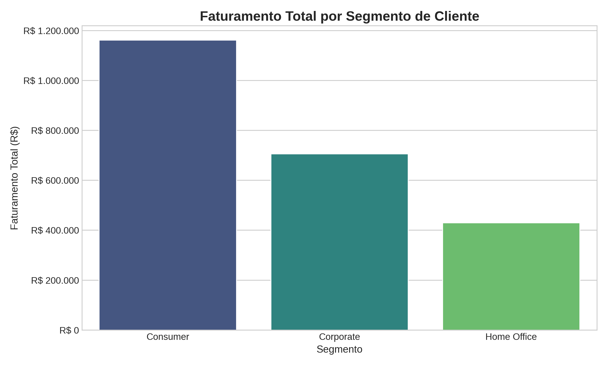
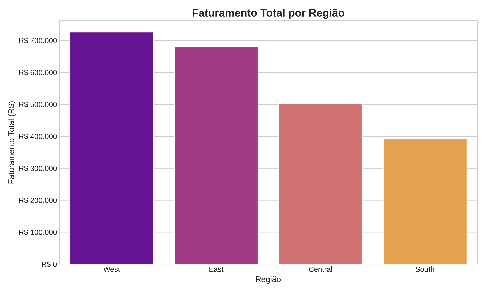
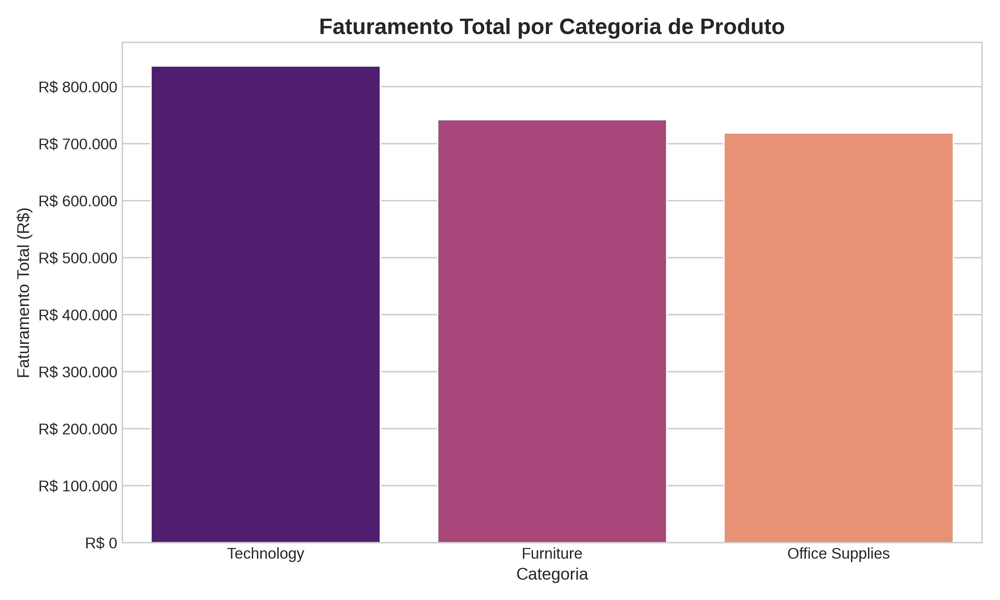
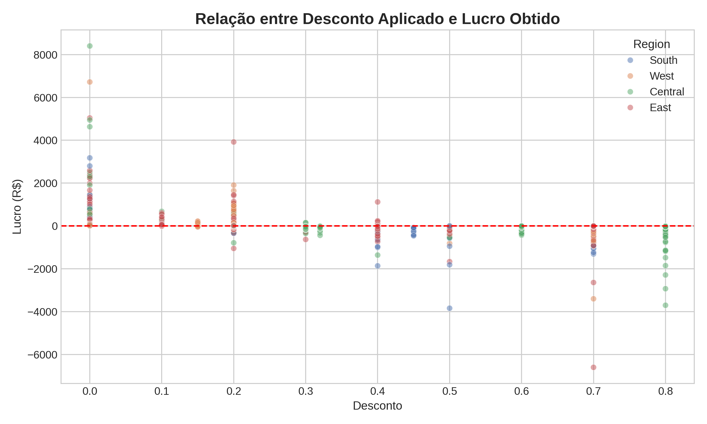

# 📊 Análise da SuperStore: Encontrando Oportunidades de Crescimento nos Dados

## 📄 Qual é o Desafio? (O Problema de Negócio)

A SuperStore é uma grande varejista que vende de tudo, de tecnologia a material de escritório. A empresa tem um grande volume de dados de vendas, mas enfrenta um desafio comum: **como usar esses dados para tomar decisões mais inteligentes?**

O objetivo deste projeto é mergulhar nos dados históricos da loja para responder a uma pergunta fundamental: **Onde estão as melhores oportunidades para a SuperStore aumentar seu faturamento e lucro?**

Para isso, a análise foi dividida em duas grandes missões:

1.  **Missão 1: Entender o Comportamento dos Clientes.** Primeiro, precisamos explorar os dados para entender como os clientes compram, com que frequência eles voltam e quem são os mais valiosos.
2.  **Missão 2: Responder a Perguntas Estratégicas.** Com o conhecimento da primeira missão, podemos testar ideias e responder a perguntas diretas da gestão, como "Quais produtos devemos promover?" ou "Em qual região devemos investir mais?".

---

## 🔬 Missão 1: Análise Exploratória (Entendendo os Clientes)

Nesta fase, agimos como detetives, procurando padrões e tendências nos dados. O script `analise_exploratoria.py` foi usado para gerar estas descobertas.

### 1. Como Estão as Vendas ao Longo do Tempo?

Analisamos a receita mês a mês e o insight foi claro: **as vendas estão crescendo consistentemente**, o que é ótimo! Além disso, descobrimos um padrão muito importante: **o final do ano é crucial para a empresa**, com picos de vendas em novembro e dezembro.

**Por que isso importa?** Isso mostra que as estratégias de fim de ano estão funcionando e que a empresa deve concentrar seus maiores esforços de marketing e estoque nesses meses para maximizar os resultados.

### 2. Os Clientes Voltam a Comprar? (Análise de Retenção/Cohort)

Aqui, agrupamos os clientes que fizeram a primeira compra no mesmo mês e observamos quantos deles voltaram nos meses seguintes. Isso mede a **fidelidade**.

O resultado foi revelador: **a loja é ótima para atrair clientes, mas tem dificuldade em mantê-los.** A retenção é boa no primeiro mês, mas cai muito depois disso.

**Por que isso importa?** A empresa está "enchendo um balde furado". É preciso criar um plano para manter os clientes engajados depois da primeira compra (com e-mails, ofertas especiais, etc.) para transformá-los em fãs leais, o que é muito mais barato do que adquirir novos clientes.

### 3. Quem São Nossos Melhores Clientes? (Análise RFM)

RFM é uma técnica para classificar clientes com base em três perguntas simples:
* **Recência:** Quão recentemente eles compraram?
* **Frequência:** Com que frequência eles compram?
* **Valor Monetário:** Quanto dinheiro eles gastam?

Essa análise foi como criar um **mapa do tesouro da nossa base de clientes**.

**Por que isso importa?** O mapa nos mostrou onde está o "ouro" (nossos **"Campeões"**, um grupo pequeno, mas que compra muito e com frequência) e onde estão as oportunidades de "resgate" (os **"Hibernando"**, clientes que não compram há muito tempo e que formam o maior grupo). Isso permite que o marketing crie campanhas direcionadas: um programa de fidelidade para os Campeões e uma campanha de "sentimos sua falta" para os Hibernando.

---

## 🎯 Missão 2: Análise Estratégica (Respondendo Perguntas-Chave)

Com o conhecimento da primeira fase, partimos para responder perguntas diretas da gestão usando uma abordagem focada. O script `analise_estrategica.py` foi utilizado para validar estas hipóteses.

### Perguntas e Respostas Baseadas em Dados:

**Pergunta 1: Qual tipo de cliente gera mais receita?**
* **Resposta:** Clientes comuns (**"Consumer"**) são responsáveis pela maior parte do faturamento. Embora clientes corporativos sejam importantes, a maior parte do nosso negócio vem de pessoas físicas.

**Pergunta 2: Qual região dos EUA é a mais importante para a SuperStore?**
* **Resposta:** A região **Oeste ("West")** lidera as vendas com uma margem significativa. Ela é o motor financeiro da empresa.

**Pergunta 3: Qual categoria de produto vende mais?**
* **Resposta:** **Tecnologia** é a categoria que mais gera receita. Embora a loja venda muito material de escritório, são os produtos de tecnologia que realmente impulsionam o faturamento.

**Pergunta 4: Dar descontos altos ajuda ou atrapalha?**
* **Resposta:** Atrapalha. A análise mostrou que **descontos agressivos (acima de 20%) estão diretamente ligados a prejuízo**. A loja perde dinheiro em muitas dessas vendas.

## 🚀 Recomendações Finais (O Plano de Ação)

Juntando todas as peças, a análise nos dá um plano de ação claro:

1.  **Foco Estratégico:** A empresa deve dobrar seus investimentos na **Região Oeste** e em produtos de **Tecnologia**, direcionando o marketing principalmente para o **cliente comum ("Consumer")**.
2.  **Revisão da Política de Descontos:** É urgente criar uma política de descontos mais inteligente. Descontos altos precisam ser reduzidos ou eliminados, especialmente em produtos que já têm margem baixa.
3.  **Marketing Direcionado:** Usar a segmentação RFM para criar duas campanhas principais: um **programa VIP** para os "Campeões" e uma **campanha de reativação** para os "Hibernando".

## 🛠️ Como o Projeto Foi Feito

Este projeto foi desenvolvido em Python, usando as bibliotecas Pandas, Matplotlib e Seaborn. Os scripts e os dados estão organizados da seguinte forma:
* **`analise_exploratoria.py`**: Contém o código para a Missão 1.
* **`analise_estrategica.py`**: Contém o código para a Missão 2.
* **`/dados`**: Pasta com os arquivos de dados brutos.
* **`/graficos`**: Pasta onde todos os gráficos foram salvos.
